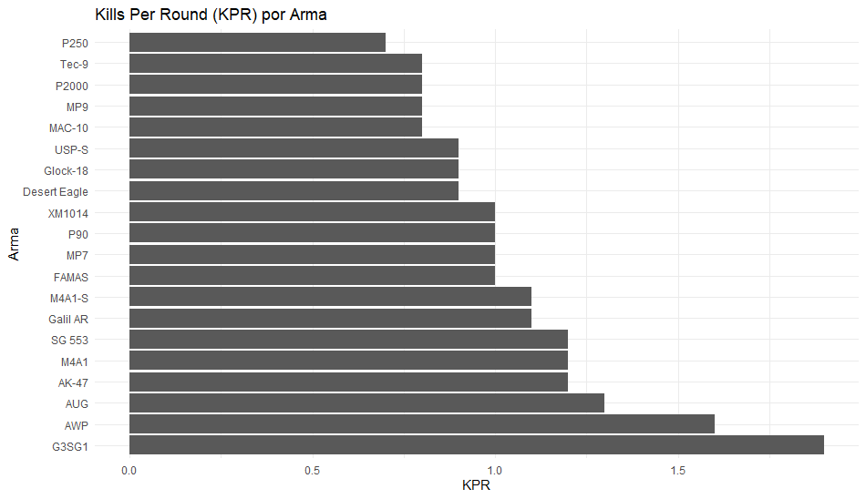

# Artigo Científico: Análise de Desempenho das Armas em Counter-Strike

# Introdução
O Counter-Strike é um dos jogos de tiro em primeira pessoa mais populares do mundo, conhecido por sua jogabilidade estratégica e armas variadas. Cada arma possui características únicas que influenciam o desempenho dos jogadores. Este estudo visa analisar as estatísticas de várias armas no jogo, focando em métricas como kills per round (KPR), porcentagem de headshots (HS %), porcentagem de tiros no peito (Chest %), porcentagem de tiros nas pernas (Leg %), e total de eliminações (Total Kills).

# Metodologia
Os dados foram coletados de uma amostra representativa de partidas de Counter-Strike, abrangendo diversas armas utilizadas pelos jogadores. As variáveis analisadas incluem KPR, HS %, Chest %, Leg %, e Total Kills. Utilizaremos o RStudio para a análise estatística e a visualização dos dados.

# Análise de Dados
Carregamento dos Dados


# Carregar pacotes necessários
```r
library(ggplot2)
library(dplyr)
```
# Criar dataframe
```r
data <- data.frame(
  Weapon = c("AK-47", "M4A1-S", "AWP", "M4A1", "USP-S", "Desert Eagle", "Glock-18", 
             "Galil AR", "FAMAS", "P90", "SG 553", "MP9", "AUG", "MAC-10", "MP7", 
             "P250", "Tec-9", "XM1014", "G3SG1", "P2000"),
  KPR = c(1.2, 1.1, 1.6, 1.2, 0.9, 0.9, 0.9, 1.1, 1.0, 1.0, 1.2, 0.8, 1.3, 0.8, 1.0, 
          0.7, 0.8, 1.0, 1.9, 0.8),
  HS_Percent = c(17.8, 14.6, 14.5, 18.0, 21.2, 28.5, 17.8, 18.1, 18.9, 10.0, 13.8, 
                 12.5, 12.7, 11.4, 9.0, 18.2, 14.9, 10.9, 15.1, 13.9),
  Chest_Percent = c(59.4, 60.3, 68.7, 60.6, 63.5, 58.7, 65.5, 57.6, 58.7, 58.3, 59.7, 
                    62.4, 61.4, 60.3, 59.1, 63.3, 63.2, 59.3, 61.3, 67.0),
  Leg_Percent = c(16.7, 18.3, 10.1, 15.5, 10.5, 9.0, 11.8, 18.4, 16.9, 24.1, 18.8, 
                  18.1, 18.5, 21.2, 24.0, 13.0, 15.6, 22.0, 15.5, 13.3),
  Total_Kills = c(370567, 181934, 164754, 104012, 94958, 84197, 83899, 63215, 50834, 
                  27907, 27572, 25846, 25335, 20285, 15535, 12575, 11796, 10428, 9289, 8306)
)
```


# Estatísticas descritivas
summary(data)


# KPR por arma
```r
ggplot(data, aes(x = reorder(Weapon, -KPR), y = KPR)) +
  geom_bar(stat = "identity") +
  coord_flip() +
  labs(title = "Kills Per Round (KPR) por Arma", x = "Arma", y = "KPR") +
  theme_minimal()
## Exemplo de Visualização

```
Rplot31.png
# Porcentagem de headshots por arma
```r
ggplot(data, aes(x = reorder(Weapon, -HS_Percent), y = HS_Percent)) +
  geom_bar(stat = "identity", fill = "midnightblue") +
  coord_flip() +
  labs(title = "Porcentagem de Headshots por Arma", x = "Arma", y = "HS %") +
  theme_minimal()
```

# Distribuição dos tiros (peito e pernas)
```r
ggplot(data, aes(x = reorder(Weapon, -Chest_Percent), y = Chest_Percent)) +
  geom_bar(stat = "identity", fill = "lightgreen") +
  coord_flip() +
  labs(title = "Porcentagem de Tiros no Peito por Arma", x = "Arma", y = "Chest %") +
  theme_minimal()
## KPR por Arma



```
```r
ggplot(data, aes(x = reorder(Weapon, -Leg_Percent), y = Leg_Percent)) +
  geom_bar(stat = "identity", fill = "darkred") +
  coord_flip() +
  labs(title = "Porcentagem de Tiros nas Pernas por Arma", x = "Arma", y = "Leg %") +
  theme_minimal()

```


# Resultados
# A análise revela que:

A arma G3SG1 possui a maior taxa de kills per round (KPR) de 1.9, seguida pela AWP com 1.6.
O Desert Eagle apresenta a maior porcentagem de headshots (HS %) com 28.5%.
A maioria das armas tem uma alta porcentagem de tiros no peito (Chest %), destacando-se a AWP com 68.7%.
Armas como a P90 e MP7 possuem uma porcentagem relativamente alta de tiros nas pernas (Leg %), com 24.1% e 24.0%, respectivamente.

# Conclusão
As diferentes armas do Counter-Strike mostram variações significativas em suas estatísticas de desempenho. Armas como a G3SG1 e AWP são altamente eficazes em termos de KPR, enquanto o Desert Eagle se destaca em headshots. Este tipo de análise pode ajudar jogadores a escolherem armas que se adequem ao seu estilo de jogo e estratégias específicas.

Este estudo pode ser expandido no futuro para incluir mais variáveis e um número maior de amostras, permitindo uma análise ainda mais detalhada das armas no Counter-Strike.

git add README.md KPR_por_arma.png
git commit -m "Adicionar gráfico de KPR por arma"
git push
